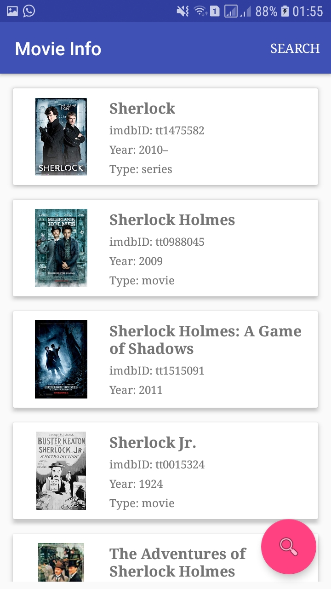
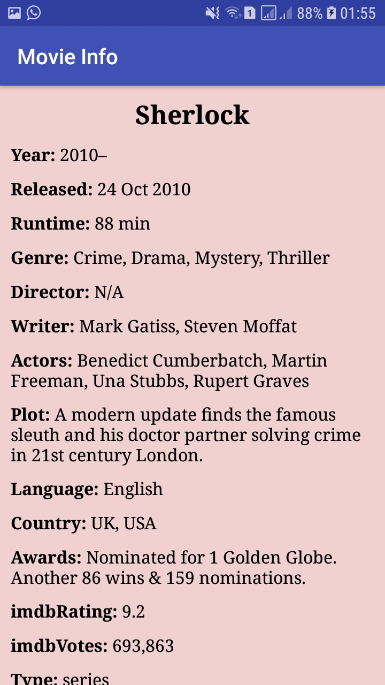

# Movie Director

**Android app  that you search a movie/serie name and get detailed informations like imdbRating,actors,awards,genre and etc**

"  "

## Used Libraries

**Picasso** - for getting image from url  
**Google's Volley libray** - For getting JSON data from api  
**omdbapi.com** - for getting movie/serie detailes  
**SpotsDialog** - while getting informations    
**RecylerView** - for showing movies in the list  
**CardView** - in list row  

### Prerequisites

This app uses omdbapi. So if you want to develop yours get apikey from omdbapi.com and change apikey in Constants class

## Authors

----Developed by ***Mirzamehdi Karimov***----

